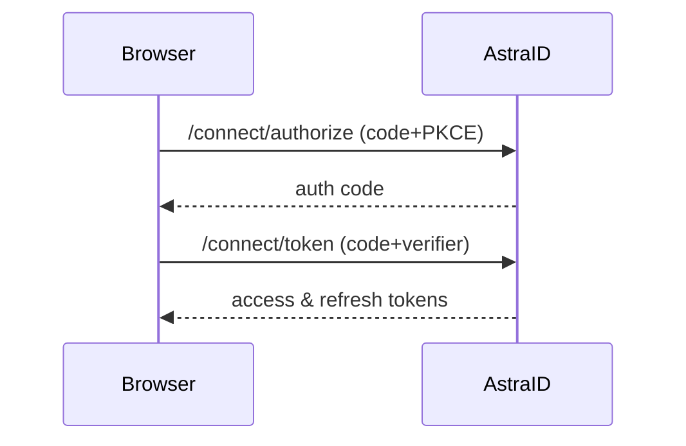
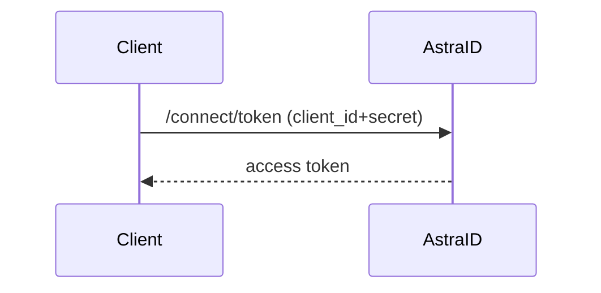

# AstraID Server – Architecture & Behavior

## Executive Summary
AstraID Server is an identity and authorization platform built on ASP.NET Core, OpenIddict, and Entity Framework Core. The solution follows a layered architecture – Domain, Application, Persistence, Infrastructure, and API – with optional Shared utilities. Domain events and an outbox pattern connect business logic to background processing. While core components are present, several areas (e.g., management APIs, OpenID endpoints) remain incomplete or lightly implemented.

## Solution & Dependencies
| Project | Purpose | Key Packages |
|---|---|---|
|AstraID.Domain|Entities, value objects, domain services|EF Core, ASP.NET Identity【F:src/AstraID.Domain/AstraID.Domain.csproj†L10-L22】|
|AstraID.Application|CQRS handlers, pipeline behaviors|MediatR, FluentValidation, Mapster【F:src/AstraID.Application/AstraID.Application.csproj†L9-L18】|
|AstraID.Persistence|DbContext, EF configurations, outbox|EF Core, OpenIddict EF Core【F:src/AstraID.Persistence/AstraID.Persistence.csproj†L8-L16】|
|AstraID.Infrastructure|Repositories, outbox, OpenIddict bridge|Serilog, OpenIddict server, health checks【F:src/AstraID.Infrastructure/AstraID.Infrastructure.csproj†L9-L24】|
|AstraID.Api|Minimal API host|ProblemDetails, OpenIddict server, Swagger【F:src/AstraID.Api/AstraID.Api.csproj†L10-L17】|

- All projects target **.NET 9** with nullable reference types enabled.
- Application & Infrastructure treat warnings as errors and enable analyzers.

## High-Level Architecture
```mermaid
C4Context
    Person(dev, "Client App")
    System_Boundary(api, "AstraID Server") {
        Container(api_layer, "API", "Minimal API")
        Container(app_layer, "Application", "MediatR CQRS")
        Container(domain_layer, "Domain", "Entities/Services")
        Container(persistence, "Persistence", "EF Core DbContext")
        Container(infrastructure, "Infrastructure", "Repositories, Outbox, OpenIddict")
    }
    SystemDb(db, "Database")
    dev -> api_layer
    api_layer -> app_layer
    app_layer -> domain_layer
    app_layer -> infrastructure
    infrastructure -> persistence
    persistence --> db
```

## Domain Layer
- Rich aggregates for users, clients, sessions, consents, and audits emit domain events collected into an outbox.
- Example: `AppUser` manages activation, lockout, MFA, and raises events such as `UserRegistered` and `PasswordChanged`【F:src/AstraID.Domain/Entities/AppUser.cs†L1-L112】【F:src/AstraID.Domain/Entities/AppUser.cs†L195-L210】.
- Aggregates inherit from `AggregateRoot<T>` exposing `DomainEvents` and `ClearDomainEvents()`【F:src/AstraID.Domain/Primitives/AggregateRoot.cs†L1-L33】.
- Domain services coordinate repositories, policies, and unit-of-work, e.g., `UserDomainService` enforces password policy and publishes events via dispatcher【F:src/AstraID.Domain/Services/UserDomainService.cs†L1-L85】.

## Application Layer
- Implements CQRS with MediatR; pipeline order: Validation → Authorization → UnitOfWork → Logging【F:src/AstraID.Application/DependencyInjection/ServiceCollectionExtensions.cs†L16-L25】.
- Handlers return `Result`/`Result<T>` and map domain errors without throwing for control flow. Example: `RegisterUserCommandHandler` maps domain result to application result【F:src/AstraID.Application/Users/Commands/RegisterUser/RegisterUserCommandHandler.cs†L1-L39】.
- AuthorizationBehavior enforces scopes/roles through `IAuthorizationService` and `ICurrentUser` abstractions【F:src/AstraID.Application/Behaviors/AuthorizationBehavior.cs†L1-L24】.
- Mapster mapping config converts domain entities to DTOs【F:src/AstraID.Application/Common/Mapping/MappingConfig.cs†L1-L27】.

## Persistence Layer
- `AstraIdDbContext` sets default schema `auth`, enables OpenIddict, and applies conventions and configurations【F:src/AstraID.Persistence/AstraIdDbContext.cs†L1-L33】.
- Fluent configurations specify column lengths, indexes, and owned value-object collections (e.g., client scopes, redirect URIs)【F:src/AstraID.Persistence/Configurations/ClientConfiguration.cs†L1-L68】.
- Outbox entity and configuration support reliable event publishing【F:src/AstraID.Persistence/Messaging/OutboxMessage.cs†L1-L15】【F:src/AstraID.Persistence/Messaging/OutboxDbConfig.cs†L1-L18】.
- Design-time factory uses environment variables for provider selection【F:src/AstraID.Persistence/DesignTime/AstraIdDbContextFactory.cs†L1-L27】.

## Infrastructure Layer
- Registers repositories, unit of work, domain event dispatcher, outbox publisher, and hosted service【F:src/AstraID.Infrastructure/DependencyInjection/ServiceCollectionExtensions.cs†L1-L51】.
- `DomainEventsCollectorInterceptor` converts domain events into outbox messages during `SaveChanges`【F:src/AstraID.Infrastructure/Persistence/Interceptors/DomainEventsCollectorInterceptor.cs†L1-L44】.
- `OutboxHostedService` polls and dispatches pending messages at an interval configurable by `ASTRAID_OUTBOX__POLL_INTERVAL_SECONDS`【F:src/AstraID.Infrastructure/Messaging/Background/OutboxHostedService.cs†L1-L27】.
- `ClientApplicationBridge` keeps OpenIddict application records in sync with client aggregates【F:src/AstraID.Infrastructure/OpenIddict/ClientApplicationBridge.cs†L1-L64】.

## API Layer
- Minimal API host wires services, current user accessor, Swagger (DEV), and middleware chain: HTTPS → Security headers → Serilog logging → CORS → Rate Limiting → Authentication → Authorization → ProblemDetails → Endpoints【F:src/AstraID.Api/Program.cs†L28-L49】.
- OpenIddict server configured with issuer, authorization/token/introspection endpoints, and grant types (Auth Code + PKCE, Client Credentials, Refresh)【F:src/AstraID.Api/OpenIddict/OpenIddictConfig.cs†L1-L37】.
- User and client management endpoints delegate to MediatR handlers and translate results to ProblemDetails on failure【F:src/AstraID.Api/Extensions/ApplicationEndpoints.Users.cs†L13-L34】【F:src/AstraID.Api/Extensions/ApplicationEndpoints.Clients.cs†L13-L40】.
- ProblemDetails mappings for validation (422), unauthorized (403), and generic errors【F:src/AstraID.Api/Extensions/ProblemDetailsExtensions.cs†L17-L44】.
- Health probes exposed at `/health/live` and `/health/ready`【F:src/AstraID.Api/Health/HealthChecksConfig.cs†L1-L23】.

## Main Flows
### Authorization Code + PKCE


### Client Credentials


## End-to-End Behavior
1. API endpoint receives command/query and passes through pipeline (validation, authorization, UoW, logging).
2. Handler invokes domain services; aggregates raise events.
3. EF interceptor captures events, writes outbox messages, and clears events.
4. Hosted service publishes outbox messages, dispatching domain events to handlers.
5. OpenIddict config exposes OAuth/OIDC endpoints; tokens issued per configured flows.

## Tech Stack Summary
- **Runtime:** .NET 9 (preview)
- **Frameworks:** ASP.NET Core, OpenIddict, Entity Framework Core
- **Libraries:** MediatR, FluentValidation, Mapster, Serilog, OpenTelemetry (skeleton)
- **Database:** SQL Server or PostgreSQL via EF Core

---

See also: [Capabilities](AstraID_Capabilities.md) · [Gap Analysis](AstraID_GapAnalysis.md) · [Readiness Report](AstraID_ReadinessChecklist.md)
