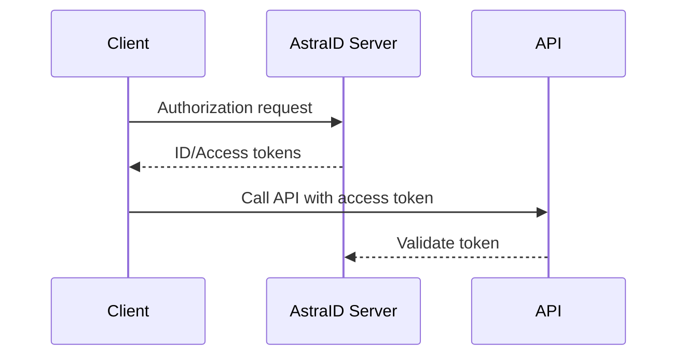

# AstraID Server

AstraID Server is a modern identity and authorization platform built on **ASP.NET Core** and **OpenIddict**. It centralizes authentication, authorization and token issuance for distributed applications.

## Features
- Hardened security with enforced HTTPS, hashed secrets and audit logging
- Horizontal scalability and cloud-friendly architecture
- Standards-compliant implementation of OAuth2 and OpenID Connect
- Centralized management of users, clients and sessions

## How It Works


## Supported Protocols and Flows
- Authorization Code with PKCE
- Client Credentials
- Refresh Token

### Token Types
- ID Token
- Access Token
- Refresh Token

## Domain Model (High Level)
- **Users** and **Roles**
- **Clients** with secrets and allowed origins
- **User Sessions** and **Consents**
- **Audit Events** for traceability
- **Tenants** and **Permissions**

## Non-Functional Qualities
- **Performance:** optimized queries and caching layers
- **Scalability:** stateless services, pluggable persistence
- **Reliability:** health checks and resilient background jobs
- **Observability:** structured logging and metrics export

## Installation & Configuration
1. Clone the repository
2. Configure environment variables:
   ```bash
   export ASTRAID_DB_PROVIDER=SqlServer
   export ASTRAID_DB_CONN="<connection-string>"
   export ASTRAID_ALLOWED_CORS="https://app.example.com"
   export ASTRAID_ISSUER="https://auth.example.com"
   export ASTRAID_OUTBOX__POLL_INTERVAL_SECONDS=5
   ```
3. Run with Docker:
   ```bash
   docker build -t astraid-server .
   docker run -e ASTRAID_DB_CONN=... -p 8080:8080 astraid-server
   ```
4. Health endpoints:
   - `GET /health/live`
   - `GET /health/ready`

## Security
- HTTPS enforced in production
- Client secrets and passwords are stored hashed
- Scope-based authorization policies
- Comprehensive audit logging

## Roadmap / Gaps & Recommendations
- Add UserInfo endpoint
- Expose token lifetime configuration
- Optimize Dockerfile layers and image size

## License
TBD

## Contributing
TBD
